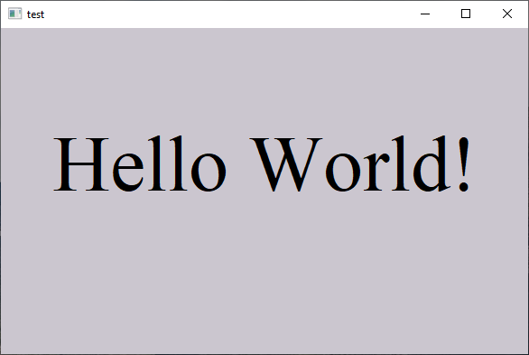

* `tests/win32_test.def`:

```
# win32 is c, all c extension works here

page: test, basic_frame
    module: win32
    use_bool: 1

    $call @init_configs
    $call @init_font
    $(for:x,y,w,h)
        $(set:cw_$1=g_main_$1)
    $call win_main, test
    $call win_loop

#-----------------------------------------
#-- pay attention to the naming convention
subcode: main_on_WM_PAINT
    &call on_paint
        $(set:bk_color=0xcfc6cb)
        $call background, $(bk_color)
        SetBkColor(hdc, $(bk_color))
        &call with_gdi, FONT_A
            $call get_rect_client, hwnd
            $call center_text, rect_client, "Hello World!"

#---------------------------------------- 
subcode: init_font
    $global HFONT fonts[20]
    $define(FONT_A) fonts[0]

    $call create_font, FONT_A, "Times New Roman", 100

subcode: init_configs
    $global g_main_x = 50
    $global g_main_y = 50
    $global g_main_w = 600
    $global g_main_h = 400
```

On Linux (cross-compiling), it will need some setup. On Cygwin, it works by pressing `F5` (`mydef_run win32_test.def`) and a window should show up.


